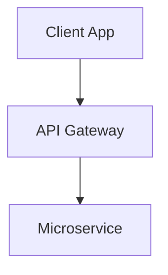

# Obsidian Markdown Cleaner 🔮

A pure-frontend web application built with **Svelte 5** and **Vite** designed to clean up messy, malformed Markdown generated by **Google Gemini**, **ChatGPT**, **Claude**, and other AI chatbots so that it pastes, renders, and structures beautifully in **Obsidian**.


---

## ✨ Key Capabilities

### 📊 1. ASCII & Unicode Diagram to Mermaid Flowchart Converter
AI chatbots (especially Gemini and Claude) frequently generate 2D ASCII/Unicode box-and-arrow diagrams that look broken in Obsidian. Obsidian Markdown Cleaner features a **100% offline, deterministic 2D spatial graph parser** that translates ASCII/Unicode diagrams into native Mermaid.js flowcharts (`flowchart TD` / `flowchart LR`):
- **Node Geometry Detection**: Recognizes single/double/round Unicode boxes (`┌─┐`, `╔═╗`, `╭─╮`), ASCII boxes (`+--+`), decision diamonds (`/  \`), and bracket nodes (`[Node]`).
- **Subtitle & Note Extraction**: Automatically converts subtitle notes (e.g., `(Loads 3 columns)`) into stylized HTML annotations (`<em>(Loads 3 columns)</em>`).
- **Edge Raycasting & Path Tracing**: Traces orthogonal connector lines across corners (`└`, `┘`, `┌`, `┐`), merge/split junctions (`┬`, `┴`, `┼`), bidirectional loops, and feedback paths.
- **Transition Label Detection**: Extracts branch labels such as `[Yes]`, `[No]`, `(publish event)`, `vs.`, and `(submit)`.
- **Direction Inference**: Automatically detects layout orientation and outputs `flowchart LR` for horizontal pipelines or `flowchart TD` for vertical stacks.
- **Live SVG Preview**: Renders interactive Mermaid SVGs inside Obsidian-styled containers with dark/light theme adaptability and a 1-click **Copy Source** button.
- **Negative Control Protection**: Discriminates between diagrams and ASCII grid tables or commented code blocks, ensuring code and data tables are never misclassified.

```
+---------------+        +---------------+
|  Client App   | -----> |  API Gateway  |
+---------------+        +---------------+
                                 |
                                 v
                         +---------------+
                         | Microservice  |
                         +---------------+
```
⬇️ *Automatically converted to:*


---

### 📋 2. ASCII Grid Table to GFM Table Converter
- Detects complex multi-row ASCII and Unicode grid tables (`+---+---+`, `|---|---|`, `┌─┬─┐`).
- Converts them into clean, standardized GitHub Flavored Markdown (GFM) tables.
- Preserves cell alignment and formatting while stripping excessive grid-line boilerplate.

---

### 👑 3. Single H1 Enforcer (Strict Heading Hierarchy)
- AI responses often contain multiple top-level `# Heading 1` tags, which clashes with Obsidian vaults where the note title is the sole H1.
- **Strict Hierarchy Mode**: Keeps the first `# Heading 1` as the primary title and demotes subsequent H1s to `## Heading 2`, shifting all nested subheadings down proportionately (`H2` &rarr; `H3`, `H3` &rarr; `H4`, capped at `H6`).
- Ensures space after hash symbols (e.g., `###Heading` &rarr; `### Heading`).

---

### 🧹 4. Loose List Tightening (Gemini Fix)
- Automatically removes awkward empty lines between list items generated by Gemini and ChatGPT.
- Supports bullet lists (`*`, `-`, `+`), numbered lists (`1.`, `a.`), task lists (`- [ ]`), and deeply nested multi-level lists.

---

### 📐 5. LaTeX Math Normalizer
- Converts LaTeX display math `\[ ... \]` to Obsidian's standard `$$ ... $$`.
- Converts LaTeX inline math `\( ... \)` to `$ ... $`.
- Live preview renders equations seamlessly using **KaTeX**.

---

### 💡 6. AI Callout Converter
- Transforms generic AI callouts into native Obsidian Callouts:
  - `> **Note:**` &rarr; `> [!note]`
  - `> **Warning:**` &rarr; `> [!warning]`
  - `> **Tip:**` &rarr; `> [!tip]`
  - `> **Important:**` &rarr; `> [!important]`
  - `> **Caution:**` &rarr; `> [!caution]`
  - `> **Info:**` / `> **Summary:**` / `> **Example:**` &rarr; `> [!info]` / `> [!abstract]` / `> [!example]`
- Preserves custom callout titles and nested markdown content.

---

### 🔤 7. Bold & Italic Whitespace Fixing
- Repairs malformed whitespace around formatting delimiters (e.g., `** word **` &rarr; `**word**`, `_ phrase _` &rarr; `_phrase_`) so Obsidian's CommonMark parser renders bold and italics correctly.

---

### 🛡️ 8. Token-Masked Code Safety
- Uses a collision-safe masking engine (`TokenMasker`) to ensure fenced code blocks (```...```), inline backticks (`...`), and existing Mermaid blocks are never mutated or corrupted during text transformations.

---

### 👁️ 9. Interactive Obsidian Reading View & Diff Viewer
- **Live Previewer**:
  - Live **Mermaid SVG diagrams** with interactive source toggle.
  - **Syntax-highlighted code blocks** with dark and light theme styles.
  - **KaTeX math rendering**.
  - **Interactive checkboxes** for task lists.
  - **Obsidian callout badges** with folding capabilities.
- **Visual Diff Viewer**: Side-by-side split view highlighting removed empty lines, adjusted spacing, and transformed tokens.

---

## ⚙️ Cleaning Presets

| Preset | Description | Highlights |
| :--- | :--- | :--- |
| 🤖 **Gemini &rarr; Obsidian** | Tailored for Google Gemini responses | List tightening, math conversion, callouts, diagram converter, table conversion, single H1 enforcement |
| 💬 **ChatGPT &rarr; Obsidian** | Optimized for OpenAI GPT-4o / o1 / o3-mini | Math normalization, callout conversion, list tightening, diagram conversion |
| 🧠 **Claude &rarr; Obsidian** | Optimized for Anthropic Claude artifacts | Code fence protection, callout conversion, diagram conversion |
| ⚡ **Obsidian Power Clean** | Maximum cleanup pipeline | All cleanup rules and converters enabled |
| 🍃 **Minimal** | Conservative formatting | Loose list tightening only |

All rules can be individually toggled and fine-tuned in the **Settings Modal** (⚙️).

---

## 🚀 One-Click Actions

- 📋 **Copy Markdown**: Copies cleaned Markdown to clipboard with instant toast confirmation.
- 💾 **Download `.md`**: Saves the note directly to your filesystem.
- 🚀 **Open in Obsidian**: Uses the `obsidian://new` URI protocol to instantly create a new note inside your Obsidian vault.

---

## 🧪 Testing Suite

Obsidian Markdown Cleaner includes an extensive **Vitest** test suite covering edge cases and regression tests:

```bash
# Run all tests
npm test

# Run tests in watch mode
npm run test:watch
```

### Test Coverage Highlights:
- **`tests/diagrams.test.ts` (14 tests)**:
  - 10 archetypal ASCII/Unicode diagrams (pipelines, split/merge, 1-to-N fan-out, decision trees, comparison matrices, pub/sub architectures, cyclic loops, multi-tier layers).
  - Negative controls verifying grid tables and commented code blocks are preserved.
- **`tests/cleaner.test.ts` (82 tests)**:
  - List tightening across mixed indentations and deep 4-level nestings.
  - Single H1 enforcer and heading normalization.
  - LaTeX display and inline math conversions.
  - Token masker code block integrity and hyphenated placeholder isolation.
  - Callout conversion patterns.
  - Whitespace fixing for bold/italics.
  - Full end-to-end multi-feature real-world samples.

---

## 🛠️ Local Development

```bash
# Install dependencies
npm install

# Start local Vite development server
npm run dev

# Run Svelte / TypeScript check
npm run check

# Run Vitest suite
npm test

# Build production bundle
npm run build
```

---

## 🌐 GitHub Pages Deployment

The application is 100% client-side with zero backend dependencies.

1. **Relative Base Path**: Preconfigured in `vite.config.ts` (`base: './'`) to support hosting in any root or subfolder.
2. **Automated CI/CD**: Includes a GitHub Actions workflow at `.github/workflows/deploy.yml` that builds, tests, and deploys on every push to `main`.

---

## 📄 License

MIT License
